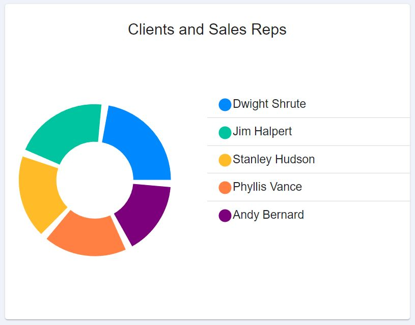
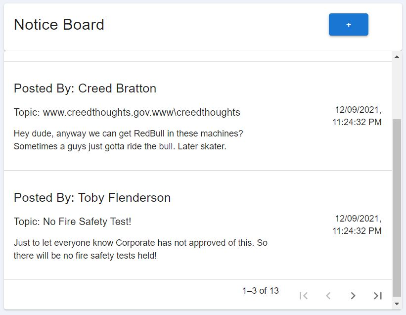
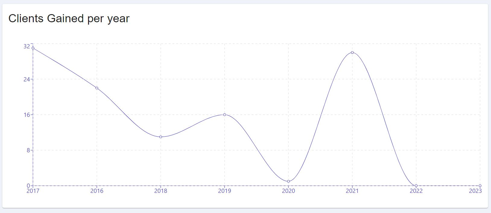
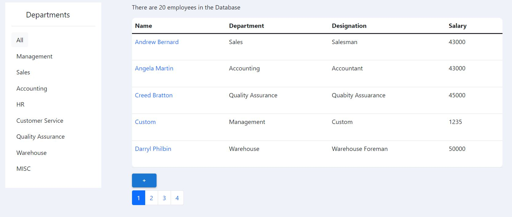
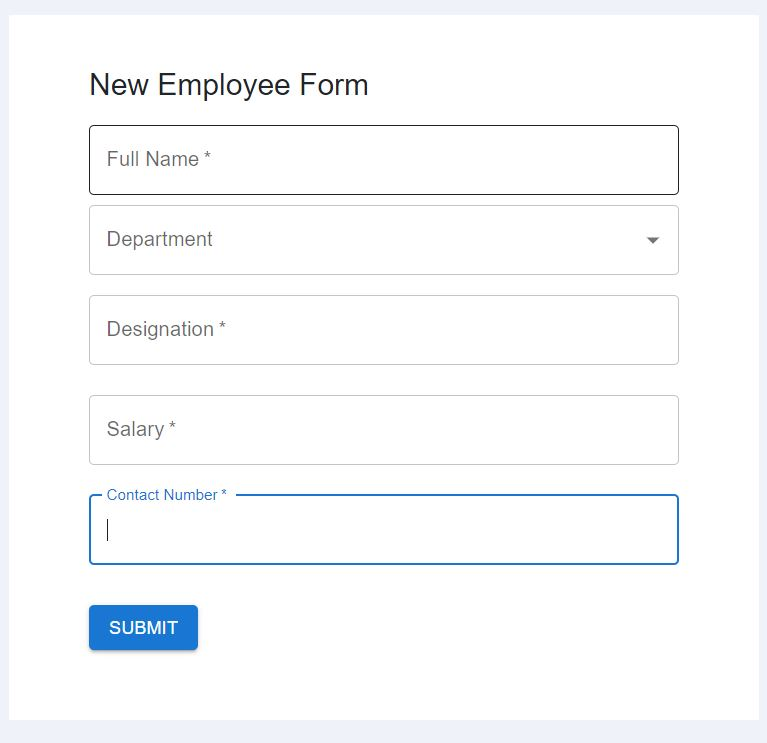

<!--
*** Thanks for checking out the Best-README-Template. If you have a suggestion
*** that would make this better, please fork the repo and create a pull request
*** or simply open an issue with the tag "enhancement".
*** Don't forget to give the project a star!
*** Thanks again! Now go create something AMAZING! :D
-->

<!-- PROJECT SHIELDS -->
<!--
*** I'm using markdown "reference style" links for readability.
*** Reference links are enclosed in brackets [ ] instead of parentheses ( ).
*** See the bottom of this document for the declaration of the reference variables
*** for contributors-url, forks-url, etc. This is an optional, concise syntax you may use.
*** https://www.markdownguide.org/basic-syntax/#reference-style-links
-->

[![Contributors][contributors-shield]][contributors-url]
[![Forks][forks-shield]][forks-url]
[![Stargazers][stars-shield]][stars-url]
[![Issues][issues-shield]][issues-url]
[![MIT License][license-shield]][license-url]
[![LinkedIn][linkedin-shield]][linkedin-url]

<!-- PROJECT LOGO -->
 

  

<h3 align="center">Dunder Mifflin - Sys</h3>
<h3> Link to fully hosted project with backend - <a href="https://eloquent-lamport-dbc1e6.netlify.app">https://eloquent-lamport-dbc1e6.netlify.app</a> <h3>
<h3> Link to backend code repo (NodeJS) 👩🏽‍💻- https://github.com/Sandwizard16/dund-sys-api<h3>

  

     
    <a href="https://github.com/Sandwizard16/dund-sys_client"><strong>Explore the docs »</strong></a>
     
     
    <a href="https://github.com/Sandwizard16/dund-sys_client">View Demo</a>
    ·
    <a href="https://github.com/Sandwizard16/dund-sys_client/issues">Report Bug</a>
    ·
    <a href="https://github.com/Sandwizard16/dund-sys_client/issues">Request Feature</a>
  

<!-- TABLE OF CONTENTS -->

  
Table of Contents

  <ol>
    <li>
      <a href="#about-the-project">About The Project</a>
      <ul>
        <li><a href="#built-with">Built With</a></li>
      </ul>
    </li>
    <li>
      <a href="#getting-started">Getting Started</a>
    </li>
    <li><a href="#usage">Usage</a></li>
    <li><a href="#roadmap">Roadmap</a></li>
    <li><a href="#contributing">Contributing</a></li>
    <li><a href="#license">License</a></li>
    <li><a href="#contact">Contact</a></li>
    <li><a href="#new-things-learnt">New Things Learnt</a></li>
  </ol>

<!-- ABOUT THE PROJECT -->

## About The Project

[![Product Name Screen Shot][product-screenshot]](https://eloquent-lamport-dbc1e6.netlify.app/)

<h3>A project that combines my love for sitcoms and interest towards programming. <h3>  
<h4>This is a fullstack project, which consists of -   🟦A simplistic UI, constructed of REACTJS (with the help of Material UI and Bootstrap),  🟩Powered by a backend API constructed of NodeJS   🟪And MONGODB for the database.   Full details of libraries and frameworks used can be found on the section below.  
The project's main functionality is providing a dashboard for employees and managers to monitor and input certain data (EG: Number of Clients, Employee details, Salesmen and their respective clients etc). It also takes the assistance of graphs and charts to visualize data and consists of features that are exclusive to admin accounts.</h4>  

(<a href="#top">back to top</a>)

### Built With

Front End

- [React.js](https://reactjs.org/)
- [MaterialUI](https://mui.com/)
- [Bootstrap](https://getbootstrap.com/)
- [Recharts](https://recharts.org/)
- [Lodash](https://lodash.com/)
- [Axios](https://github.com/axios/axios)

 

### Built With

Backend

- [Node.js](https://nodejs.org/en/)
- [MongoDB](https://www.mongodb.com/)
- [Mongoose](https://mongoosejs.com/)
- [JSON Web Tokens](https://jwt.io/)
- [Bcrypt](https://www.npmjs.com/package/bcrypt)

(<a href="#top">back to top</a>)

<!-- GETTING STARTED -->

## Getting Started

The app is fully hosted on Heroku and Netlify - <a>https://eloquent-lamport-dbc1e6.netlify.app</a>.
You require an account to browse the full features that are on this app. 
Please send an email at - zuhayersiddique162@gmail.com to get an account.

(<a href="#top">back to top</a>)

<!-- USAGE EXAMPLES -->

## Usage

<h3>My main motivation towards building this project was finding out how to use data from the database displaying them using charts and graphs</h3>

<h4>The PieChart(From recharts) represents the number of clients each Sales Representatives have. The values are stored by referencing each client to their respective sales rep's unique id. Thus, creating a one to many relationship between sales reps and clients.</h4>

<h4>The noticeboard is a feature that is composed of MUI and can be used to pin important highlights and messages. It automatically takes the username from the logged in user's Json Web Token.</h4>

<h4>Also a Rechart component, this displays the number of clients gained in certain years and is updated whenever a new client is added.</h4>

<h4>Displays the number of employees that are currently in the database. With custom sorting, filtering and pagination that is implemented using pure javascript.  I used pure javascript algorithms to find out how these features are actually implemented in apps</h4>

<h4>New employees and clients can be added into the database using this form. However, new employees can only be added using Admin accounts</h4>

(<a href="#top">back to top</a>)

## New Things learnt

- Using JWT for authorization and extract user data for different account features.
- Using lodash library to implement some functionalities
- Deploying and connecting app over Netlify and Heroku
- Protecting routes
- Better understanding of Asynchronous Javascript
- Implementing and modelling relationships between different data
- Better understanding of Forms in ReactJS
- Deeper understanding of ReactJS hooks as I had learned React using Class Based components.

(<a href="#top">back to top</a>)

## Contact

Email - zuhayersiddique162@gmail.com  
Project Link: [https://github.com/Sandwizard16/dund-sys_client](https://github.com/Sandwizard16/dund-sys_client)  
See the [open issues](https://github.com/Sandwizard16/dund-sys_client/issues) for a full list of proposed features (and known issues).

(<a href="#top">back to top</a>)

[contributors-shield]: https://img.shields.io/github/contributors/Sandwizard16/dund-sys_client.svg?style=for-the-badge
[contributors-url]: https://github.com/Sandwizard16/dund-sys_client/graphs/contributors
[forks-shield]: https://img.shields.io/github/forks/Sandwizard16/dund-sys_client.svg?style=for-the-badge
[forks-url]: https://github.com/Sandwizard16/dund-sys_client/network/members
[stars-shield]: https://img.shields.io/github/stars/Sandwizard16/dund-sys_client.svg?style=for-the-badge
[stars-url]: https://github.com/Sandwizard16/dund-sys_client/stargazers
[issues-shield]: https://img.shields.io/github/issues/Sandwizard16/dund-sys_client.svg?style=for-the-badge
[issues-url]: https://github.com/Sandwizard16/dund-sys_client/issues
[license-shield]: https://img.shields.io/github/license/Sandwizard16/dund-sys_client.svg?style=for-the-badge
[license-url]: https://github.com/Sandwizard16/dund-sys_client/blob/master/LICENSE.txt
[linkedin-shield]: https://img.shields.io/badge/-LinkedIn-black.svg?style=for-the-badge&logo=linkedin&colorB=555
[linkedin-url]: https://linkedin.com/in/linkedin_username
[product-screenshot]: ./assets/Dashboard.JPG
